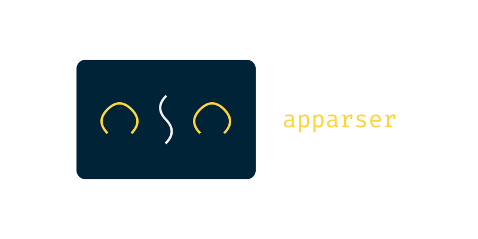

[](https://github.com/lexter0705/appwindows/blob/master/LICENSE.md) [](https://github.com/apparser-development/appwindows/actions/workflows/unit_tests.yml)
<br>
[](https://pepy.tech/projects/appwindows) 
[](https://apparser.gitbook.io/appwindows)
<br>
[](https://pypi.org/project/appwindows/)
[](https://github.com/apparser-development/appwindows)
[](https://github.com/apparser-development/appwindows/issues)

# Apparser
The apparser library is designed for testing and managing computer programs.

# Install
```bash
pip install apparser
```

# Examples

1) Open terminal and write "Hello World!"
```python
from apparser import App
from apparser.geometry import RelativelyPoint
from apparser.instructions import Algorithm, MouseClickTo, WriteText, Sleep

algorithm = Algorithm([
        Sleep(1), # Wait for the application to open.
        MouseClickTo(RelativelyPoint(0.5, 0.5)), # Click to window center for start writing
        WriteText("Hello World") # Write text
])

app = App("cmd.exe")

algorithm.perform(app.ui)
```

# Docs
All documentation <a href="#">here</a> <br>
Link to <a href="https://pypi.org/project/appwindows/">PyPi</a>

# For Developers
1) If something doesn't work - open issue.
2) If you want something fixed - open issue.
3) If you can help with the library - email.

apparser.development@gmail.com

Any help in development is welcome)!
