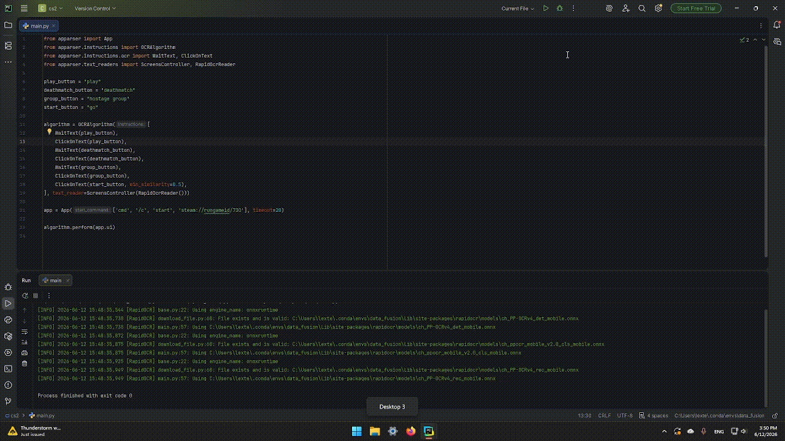

[](https://github.com/apparser-development/apparser/blob/master/LICENSE.md) [](https://github.com/apparser-development/apparser/actions/workflows/unit_tests.yml)
<br>
[](https://pepy.tech/projects/apparser) 
[](https://apparser-development.github.io/apparser/)
<br>
[](https://pypi.org/project/apparser/)
[](https://github.com/apparser-development/apparser)
[](https://github.com/apparser-development/apparser/issues)

# Apparser
Apparser is a Python library designed for automating desktop applications and managing UI using artificial intelligence, such as OCR or object detection models.

# Install
```bash
pip install apparser
```

# Examples
1) Open CS2 and start game
#### Code
```python
from apparser import App
from apparser.instructions import OCRAlgorithm
from apparser.instructions.ocr import WaitText, ClickOnText
from apparser.text_readers import ScreensController, RapidOcrReader

play_button = "play"
deathmatch_button = "deathmatch"
group_button = "hostage group"
start_button = "go"

algorithm = OCRAlgorithm([
    WaitText(play_button),
    ClickOnText(play_button),
    WaitText(deathmatch_button),
    ClickOnText(deathmatch_button),
    WaitText(group_button),
    ClickOnText(group_button),
    ClickOnText(start_button, min_similarity=0.5),
], text_reader=ScreensController(RapidOcrReader()))

app = App(['cmd', '/c', 'start', 'steam://rungameid/730'], timeout=20)

algorithm.perform(app.ui)

```
#### Video



# Docs
All documentation <a href="https://apparser-development.github.io/apparser/">here</a> <br>
Link to <a href="https://pypi.org/project/apparser/">PyPI</a>

# For Developers
1) If something doesn't work - open issue.
2) If you want something fixed - open issue.
3) If you can help with the library - email.

apparser.development@gmail.com

Any help in development is welcome!
