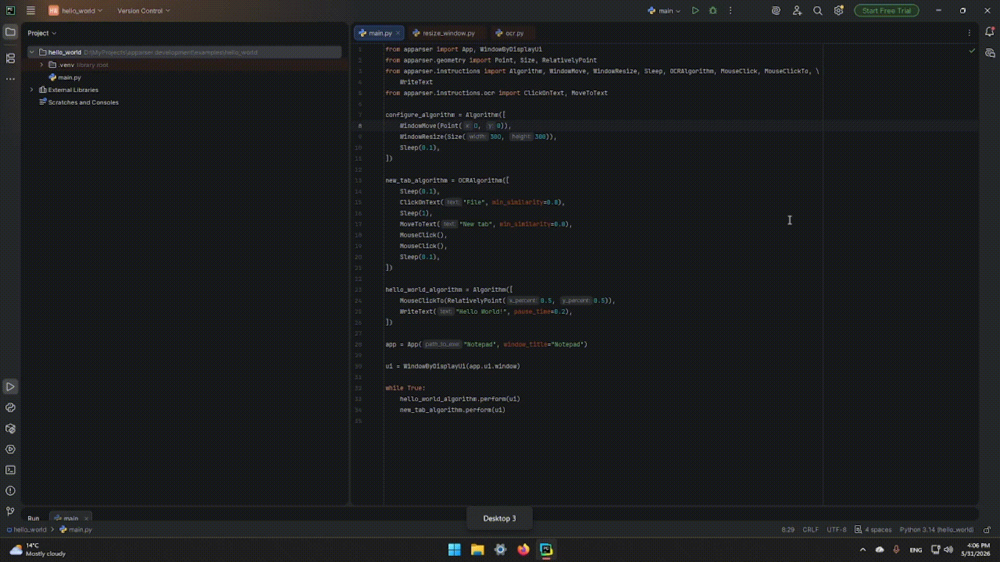

Text Recognition
==================

Open new tab and write "Hello World!" in Notepad.

Install
--------

Install the OCR extra before using OCRAlgorithm.

.. code-block:: bash

   pip install "apparser[ocr]"

Code
--------

.. code-block:: python

    from apparser import App, WindowByDisplayUi
    from apparser.geometry import Point, Size, RelativelyPoint
    from apparser.instructions import Algorithm, WindowMove, WindowResize, Sleep, OCRAlgorithm, MouseClick, MouseClickTo, \
        WriteText
    from apparser.instructions.ocr import ClickOnText, MoveToText

    configure_algorithm = Algorithm([
        WindowMove(Point(0, 0)),
        WindowResize(Size(300, 300)),
        Sleep(0.1),
    ])

    new_tab_algorithm = OCRAlgorithm([
        Sleep(0.1),
        ClickOnText("File", min_similarity=0.8),
        Sleep(1),
        MoveToText("New tab", min_similarity=0.8),
        MouseClick(),
        MouseClick(),
        Sleep(0.1),
    ])

    hello_world_algorithm = Algorithm([
        MouseClickTo(RelativelyPoint(0.5, 0.5)),
        WriteText("Hello World!", pause_time=0.2),
    ])

    app = App("Notepad", window_title="Notepad")

    configure_algorithm.perform(app.ui)

    ui = WindowByDisplayUi(app.ui.window)

    try:
        new_tab_algorithm.perform(ui)
        hello_world_algorithm.perform(ui)
    finally:
        app.stop_app()

Video
--------

