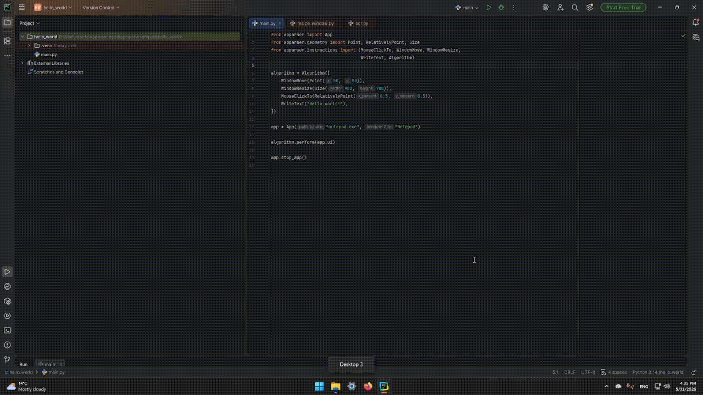

Quick Start
============

Open Notepad and write "Hello World!"

Code
--------

.. code-block:: python

   from apparser import App
   from apparser.geometry import Point, RelativelyPoint, Size
   from apparser.instructions import (MouseClickTo, WindowMove, WindowResize,
                                     WriteText, Algorithm)

   algorithm = Algorithm([
       WindowMove(Point(50, 50)),
       WindowResize(Size(900, 700)),
       MouseClickTo(RelativelyPoint(0.5, 0.5)),
       WriteText("Hello world!"),
   ])

   app = App("notepad.exe", "Notepad")

   algorithm.perform(app.ui)

   app.stop_app()

Video
--------

